# Chat系统人员分工
编写人：占文星
更新时间：2021年12月5日

## Chat系统项目截止日期：2021年12月15日

### 设计实验报告（3份）
占文星、任涛、袁宏业

### 答辩PPT（1份）分工如下
任涛、袁宏业

## 主要开发工作截止日期：2021年12月5日

### Server端程序运行流程图（🤔考虑细化）

```mermaid
flowchart TD
    程序启动-->数据库配置
    数据库配置-->手动配置
    数据库配置-->默认配置
    手动配置-->数据库测试连接
    默认配置-->数据库测试连接-->|失败|程序关闭
    数据库测试连接-->|成功|开启选择器-->ServerSocketChannel配置-->聊天室启动-->监听选择器事件-->连接事件-->SocketChannel配置-->删除当前活动
    监听选择器事件-->可读事件-->获取SocketChannel-->|JSON|反射创建类调用方法
    反射创建类调用方法-->|JSON|判断发送对象-->|JSON|Client-->删除当前活动-->监听选择器事件
```

### Client端程序运行流程图（🤔考虑重构）
```mermaid
flowchart TD
程序启动-->显示Home主页
显示Home主页-->|1|注册用户-->注册用户名-->注册密码-->注册邮箱-.JSON.->Server-.JSON:Home失败.->显示Home主页
显示Home主页-->|2|登陆-->登陆用户名-->登陆密码-.JSON.->Server-.JSON:登陆成功.->显示System主页
Server-.JSON:注册成功.->显示Home主页
显示Home主页-->|3|找回密码-->输入找回密码的用户名-->输入找回密码的邮箱-.JSON.->Server-.JSON:找回成功.->显示密码-->显示Home主页
显示Home主页-->|4|关闭程序
显示System主页-->|1|查询在线用户-.JSON.->Server-.JSON.->在线结果展示-->显示System主页
显示System主页-->|2|私聊-->输入对方用户名-->输入私聊内容-.JSON.->Server
显示System主页-->|3|群聊-->输入群聊内容-.JSON.->Server
显示System主页-->|4|修改密码-->输入旧密码-->输入新密码-.JSON.->Server
显示System主页-->|5|注销用户-->输入密码-.JSON.->Server
显示System主页-->|6|退出-.JSON.->Server-.JSON:下线成功.->显示Home主页
```

### 聊天功能时序图

```mermaid
sequenceDiagram
  autonumber
  par 私聊流程 1-4
    Client1->>+Server:Client2-你今天吃的什么？
    Server-->>-Client2:Client1:你今天吃的什么？
    Client2->>+Server:Client1-清真的牛肉拉面
    Server-->>-Client1:Client2:清真的牛肉拉面
  end
  
  par 群聊流程 5-16
    Client3->>+Server:All-群里面有人吗？
    Server-->>Client3:群聊:Client3:群里面有人吗？
    Server-->>Client2:群聊:Client3:群里面有人吗？
    Server-->>-Client1:群聊:Client3:群里面有人吗？
    Client1->>+Server:All-我在群里啊！
    Server-->>Client3:群聊:Client1:我在群里啊！
    Server-->>Client2:群聊:Client1:我在群里啊！
    Server-->>-Client1:群聊:Client1:我在群里啊！
    Client2->>+Server:All-我也在群里啊！
    Server-->>Client3:群聊:Client2:我也在群里啊！
    Server-->>Client2:群聊:Client2:我也在群里啊！
    Server-->>-Client1:群聊:Client2:我也在群里啊！
  end

  par 混合流程 18-22
    Client3->>+Server:All-群里面有人吗？
    Server-->>Client3:群聊:Client3:群里面有人吗？
    Server-->>Client2:群聊:Client3:群里面有人吗？
    Client2->>+Server:Client1-今天你打算去哪里玩？
    Server-->>-Client1:Client2:今天你打算去哪里玩？
    Server-->>-Client1:群聊:Client3:群里面有人吗？
  end
```


### 数据库
#### 默认配置(YAML)
```yaml
database:
  url: 'jdbc:mysql://127.0.0.1:3306/Chat?characterEncoding=UTF-8'
  username: 'root'
  password: '123456'
```

#### USER表结构
|字段名|数据类型|约束|IS NOT NULL|主键|
|:-:|:-:|:-:|:-:|:-:|
|username|varchar(255)|长度1到10，只支持中文、英文、数字、下划线|✅|✅|
|password|varchar(255)|长度6到18，只支持英文、数字、下划线|✅| |
|email|varchar(255)|email格式|✅| |

### Request（JSON格式字符串） 客户端和服务端传输内容要求

字符串示例: {"body":{"password":"test","username":"test"},"head":{"PATH":"Home-login","TOKEN":"<span style="color:red">(username)</span>"}}

#### head

| key | value | 说明 |
|:-:|:-:|:-:|
| PATH |Home-login/Clinet|路径 Client-View-Home-Login 取后2个名称 <span style="color:red">路径使用小写命名</span>|
|TOKEN|<span style="color:red">(username)</span>|身份 无值传空 通过算法进行处理|
|TO|username|发送用户名|

#### body(携带参数)

|key|value|
|:-:|:-:|
|request-username|testname|
|request-password|test|
|request-email|test@test.com|
|response-message|"操作成功！"|

### 源码（1份）分工如下
#### 占文星
截止完成日期：2021年12月5日

|序号|完成情况|功能模块|模块名称|
|:-:|:-:|:-:|:-:|
|1|✅|Server-Function-CreateUser|服务端-功能-添加用户|
|2|✅|Server-Function-SelectUser|服务端-功能-查询用户|
|3|✅|Server-Function-DeleteUser|服务端-功能-删除用户|
|4|✅|Server-Function-UpdateUser|服务端-功能-修改用户|
|5|✅|Server-Function-ServerSocketChannel|服务端-功能-服务端通道|
|6|✅|Server-Function-OnlineUser|服务端-功能-在线用户|
|7|✅|Server-Function-OneToOne|服务端-功能-私聊|
|8|✅|Server-Function-OneToMore|服务端-功能-群聊|
|9|✅|Server-Fucntion-DataBase-DataManage|服务端-功能-数据库-数据管理|
|10|✅|Server-Fucntion-Log|服务端-功能-日志|


#### 任涛
截止完成日期：2021年12月5日

|序号|完成情况|功能模块|模块名称|
|:-:|:-:|:-:|:-:|
|1|✅|Client-View-Home-Create|客户端-首页-显示-用户注册|
|2|✅|Client-View-Home-Login|客户端-首页-显示-用户登陆|
|3|✅|Client-View-Home-RetrievePassword|客户端-首页-显示-找回密码|
|4|✅|Client-View-Home-Quit|客户端-首页-显示-系统退出|
|5|✅|Client-Function-Home-Create|客户端-首页-功能-用户注册|
|6|✅|Client-Function-Home-Login|客户端-首页-功能-用户登陆|
|7|✅|Client-Function-Home-RetrievePassword|客户端-首页-功能-找回密码|
|8|✅|Client-Function-Home-Quit|客户端-首页-功能-系统退出|

#### 袁宏业
完成日期：2021年12月5日

|序号|完成情况|功能模块|模块名称|
|:-:|:-:|:-:|:-:|
|1|✅|Client-View-System-OnlineUser|客户端-系统首页-显示-在线人员|
|2|✅|Client-View-System-OneToOne|客户端-系统首页-显示-私聊|
|3|✅|Client-View-System-OneToMore|客户端-系统首页-显示-群聊|
|4|✅|Client-View-System-DeleteUser|客户端-系统首页-显示-账号注销|
|5|✅|Client-View-System-ChangePassword|客户端-系统首页-显示-账号密码修改|
|6|✅|Client-View-System-Quit|客户端-系统首页-显示-系统退出|
|7|✅|Client-Function-System-OnlineUser|客户端-系统首页-功能-在线人员|
|8|✅|Client-Function-System-OneToOne|客户端-系统首页-功能-私聊|
|9|✅|Client-Function-System-MoreToMore|客户端-系统首页-功能-群聊|
|10|✅|Client-Function-System-DeleteUser|客户端-系统首页-功能-账号注销|
|11|✅|Client-Function-System-ChangePassword|客户端-系统首页-功能-账号密码修改|
|12|✅|Client-Function-System-Quit|客户端-系统首页-功能-系统退出|