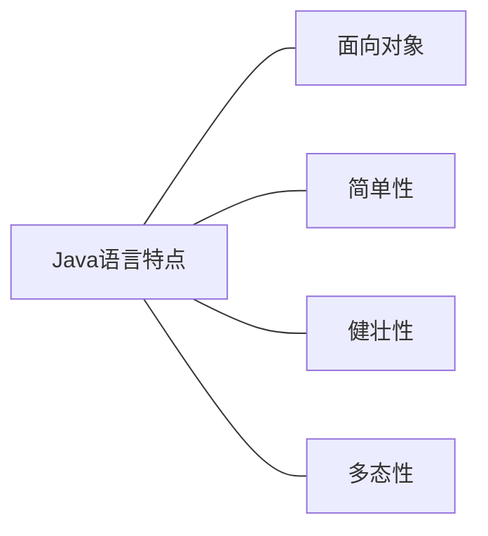
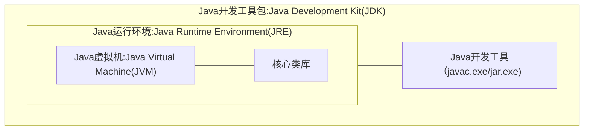

# Java 知识点
> 作者 : RedCrazyGhost
> 创建时间 : 2022-04-23
> 修改时间 : 2022-04-28
> 阅读时长 : 7分钟
> 标签 :  <span class="badge bg-primary">Java</span> 



### JDK、JRE、JVM关系


### 权限修饰符

⚠️注意⚠️：protected可以 可以修饰数据成员，构造方法，方法成员，不能修饰类（内部类除外）。
接口及接口的成员变量和成员方法不能声明为 protected。

|修饰符|当前类|同一包内|子孙类（同一包）|子孙类（不同包）|其他包|
|:-:|-:|-:|-:|-:|-:|
|public|	Y|	Y|	Y|	Y|	Y|
|protected|	Y|	Y|	Y|	Y/N（注意）|	N|
|default|	Y|	Y|	Y|	N|	N|
|private|	Y|	N|	N|	N|	N|

### ==和equals
==操作符简单理解为地址值的比较
equals()方法简单理解为对象值的比较
(这里涉及到JVM的存储，暂不展开讲)

Object类的equals()方法
```Java
public boolean equals(Object obj) {
    return (this == obj);
}
```

String类重写Object类的equals()方法
```Java
public boolean equals(Object anObject) {
    if (this == anObject) {
        return true;
    }
    if (anObject instanceof String) {
        String aString = (String)anObject;
        if (coder() == aString.coder()) {
            return isLatin1() ? StringLatin1.equals(value, aString.value)
                                : StringUTF16.equals(value, aString.value);
        }
    }
    return false;
}
```

### 构造方法
**构造方法针对类的初始化创建**
每个类在没有手动编写构造方法的时候，会自动带有一个无参的构造方法
>编写格式
>```Java
>权限修饰符 类名(参数){
>    代码块
>}
>```

>示例
>```Java
>class Person{
>    private String name;
>    public Person(){
>       this.name="小王";
>    }
>    public static void main(String[] args) {
>        Person p = new Person();
>        System.out.println(p.name);
>        //输出结果：小王
>    }
>}
>```

### 方法重写和重载
这里先聊方法重写(Override)
重写是对继承的父类方法的进行方法内容重新编写
⚠️注意⚠️：super可以在方法调用父类的方法
```Java
class Animal{
    public void call(){
        System.out.println("动物叫");
    }
}
class Cat extends Animal{
    @Override
    public void call() {
        //super 调用父类的方法
        super.call();

        System.out.println("喵～");
    }
}
class Test{
    public static void main(String[] args) {
        new Animal().call();
        new Cat().call();
        /*  输出结果：
        *   动物叫
        *   动物叫
        *   喵～
        */
    }
}
```

接下来来说重载(Overload)
重载是同一个类中的方法名相同但所需形式参数不同
⚠️注意⚠️：参数位置也会造成重载
```Java
class Animal{
    public void call(){
        System.out.println("动物叫");
    }
    public int call(String Animal){
        if (Animal.equals("猫")){
            System.out.println("喵～");
        }
        return 1;
    }
}
class Test{
    public static void main(String[] args) {
        Animal animal=new Animal();
        animal.call();
        System.out.println(animal.call("猫"));
        /*  输出结果：
        *   动物叫
        *   喵～
        *   1
        */
    }
}
```