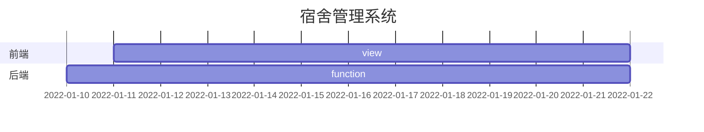
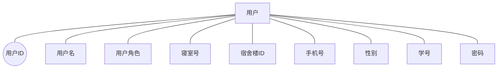

# JavaEE项目

```mermaid
gantt
    title 宿舍管理系统
    dateFormat  YYYY-MM-DD
    section 占文星
    section 前端
    view:view, 2022-01-11, 11d
    section 后端
    function :function, 2022-01-10, 12d
```

```mermaid
flowchart TD
用户---stu_id((用户ID))
用户---用户名
用户---用户角色
用户---寝室号
用户---宿舍楼ID
用户---手机号
用户---性别
用户---学号
用户---密码


```