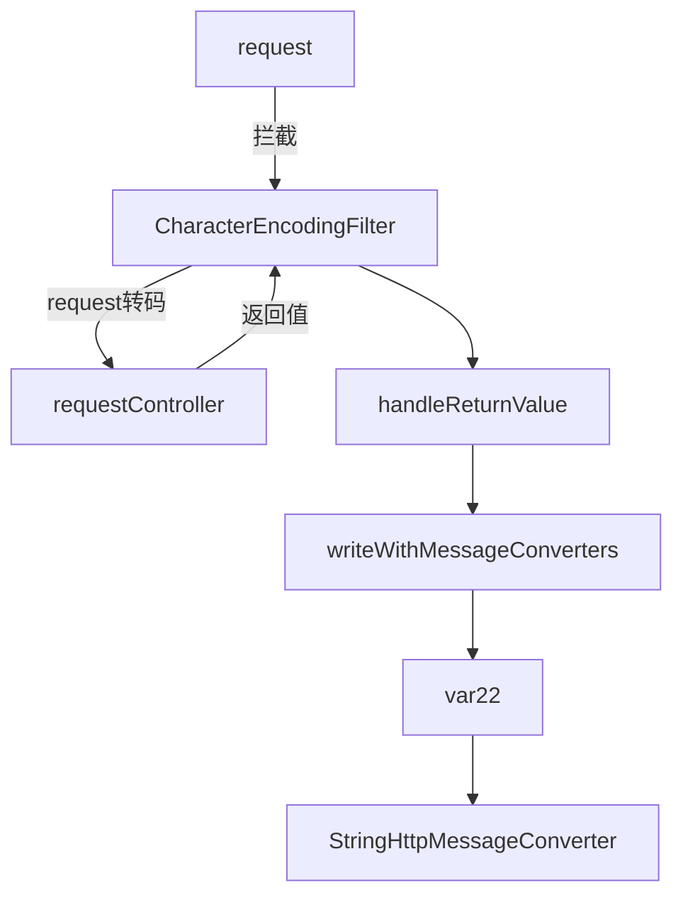

# SSM整合中请求乱码问题
> 作者 : RedCrazyGhost
> 创建时间 : 2022-04-22 
> 修改时间 : 2022-04-28
> 阅读时长 : 5分钟
> 标签 : <span class="badge bg-secondary">Mac OS</span> <span class="badge bg-danger">问题</span> <span class="badge bg-success">解决</span> <span class="badge rounded-pill bg-success">Spring MVC</span> <span class="badge bg-primary">Java</span> <span class="badge bg-black">源码</span> <span class="badge bg-black">网络</span> 

### 请求返回内容乱码问题
通过查看请求的<kbd>Response Head</kbd>可以看到返回的<kbd>Content-Type</kbd>携带的编码是<kbd>charset=ISO-8859-1</kbd>

虽然Web.xml已经配置了<kbd>CharacterEncodingFilter.class</kbd>并且也生效了，但是并没有达到修改编码的效果。
```xml
<filter>
        <filter-name>encodingFilter</filter-name>
        <filter-class>org.springframework.web.filter.CharacterEncodingFilter</filter-class>
        <init-param>
            <param-name>encoding</param-name>
            <param-value>UTF-8</param-value>
        </init-param>
        <init-param>
            <param-name>forceEncoding</param-name>
            <param-value>true</param-value>
        </init-param>
    </filter>
    <filter-mapping>
        <filter-name>encodingFilter</filter-name>
        <url-pattern>/*</url-pattern>
    </filter-mapping>
```

### 深入源码


### 罪魁祸首
```java
public class StringHttpMessageConverter extends AbstractHttpMessageConverter<String> {
    //默认的Charset就是ISO-8859-1
    public static final Charset DEFAULT_CHARSET = Charset.forName("ISO-8859-1");

    .....
}
```
因为Spring MVC的设计思想是通过<kbd>Request Head</kbd>的<kbd>Accept</kbd>设置编码来达到返回的<kbd>Resopnse Head</kbd>的<kbd>Content-Type</kbd>保持一致的编码

通俗一句话：传什么是什么，不传就是默认

### 解决方法
业务量极少的情况可以使用下面的代码曲线救国
```java
@RequestMapping(value="/path",produces="*/*;charset=utf-8" )
```

终极解决方案就是修改默认的的返回编码
在spring-mvc.xml中使用下面的配置即可
```xml
<!--开启注解-->
<mvc:annotation-driven>
    <!--修改默认编码-->
    <mvc:message-converters register-defaults="true">
        <bean class="org.springframework.http.converter.StringHttpMessageConverter">
            <constructor-arg value="UTF-8" />
        </bean>
    </mvc:message-converters>
</mvc:annotation-driven>
```
