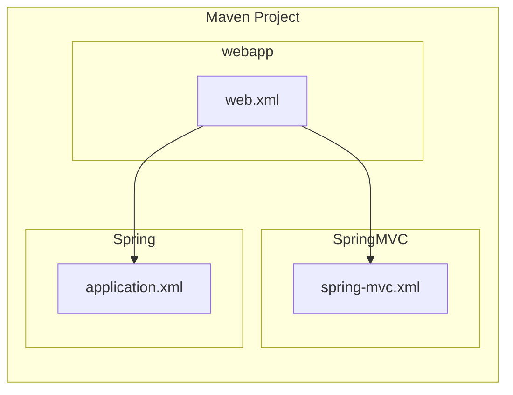

# SSM 配置

Maven POM.xml

```xml
<?xml version="1.0" encoding="UTF-8"?>
<project xmlns="http://maven.apache.org/POM/4.0.0"
         xmlns:xsi="http://www.w3.org/2001/XMLSchema-instance"
         xsi:schemaLocation="http://maven.apache.org/POM/4.0.0 http://maven.apache.org/xsd/maven-4.0.0.xsd">
    <modelVersion>4.0.0</modelVersion>

    <groupId>ghost</groupId>
    <artifactId>ssm</artifactId>
    <version>1.0-SNAPSHOT</version>

    <properties>
        <maven.compiler.source>8</maven.compiler.source>
        <maven.compiler.target>8</maven.compiler.target>
        <springframework-version>5.3.18</springframework-version>
        <log4j-version>2.17.2</log4j-version>
        <druid-version>1.2.8</druid-version>
        <mysql-version>8.0.28</mysql-version>
        <mybatis-veriosn>3.5.9</mybatis-veriosn>
        <mybatis-spring-version>2.0.7</mybatis-spring-version>
        <lombok-version>1.18.22</lombok-version>
    </properties>


    <dependencies>

        <!--注解 自动生成常用方法-->
        <dependency>
            <groupId>org.projectlombok</groupId>
            <artifactId>lombok</artifactId>
            <version>${lombok-version}</version>
            <scope>provided</scope>
        </dependency>

        <!--SpringMVC依赖-->
        <dependency>
            <groupId>org.springframework</groupId>
            <artifactId>spring-webmvc</artifactId>
            <version>${springframework-version}</version>
        </dependency>

        <!--log4j日志框架-->
        <dependency>
            <groupId>org.apache.logging.log4j</groupId>
            <artifactId>log4j-core</artifactId>
            <version>${log4j-version}</version>
        </dependency>
        <dependency>
            <groupId>org.apache.logging.log4j</groupId>
            <artifactId>log4j-api</artifactId>
            <version>${log4j-version}</version>
        </dependency>

        <!--Java MySQL 连接驱动-->
        <dependency>
            <groupId>mysql</groupId>
            <artifactId>mysql-connector-java</artifactId>
            <version>${mysql-version}</version>
        </dependency>

        <!--alibaba druid 数据库连接池-->
        <dependency>
            <groupId>com.alibaba</groupId>
            <artifactId>druid</artifactId>
            <version>${druid-version}</version>
        </dependency>

        <!--Spring-JDBC框架-->
        <dependency>
            <groupId>org.springframework</groupId>
            <artifactId>spring-jdbc</artifactId>
            <version>${springframework-version}</version>
        </dependency>

        <!--Mybatis 数据库框架-->
        <dependency>
            <groupId>org.mybatis</groupId>
            <artifactId>mybatis</artifactId>
            <version>${mybatis-veriosn}</version>
        </dependency>
        <dependency>
            <groupId>org.mybatis</groupId>
            <artifactId>mybatis-spring</artifactId>
            <version>${mybatis-spring-version}</version>
        </dependency>

    </dependencies>
</project>
```




Webapp web.xml

```xml
<?xml version="1.0" encoding="UTF-8"?>
<web-app xmlns="http://xmlns.jcp.org/xml/ns/javaee"
         xmlns:xsi="http://www.w3.org/2001/XMLSchema-instance"
         xsi:schemaLocation="http://xmlns.jcp.org/xml/ns/javaee http://xmlns.jcp.org/xml/ns/javaee/web-app_4_0.xsd"
         version="4.0">

    <!--WEB 应用名称-->
    <display-name>ssm</display-name>

    <!--WEB 应用描述-->
    <description>Spring+SpringMVC+Mybatis Web应用</description>
    
    <context-param>
        <param-name>contextConfigLocation</param-name>
        <param-value>classpath:/application.xml</param-value>
    </context-param>

    <!--开启监听-->
    <listener>
        <listener-class>org.springframework.web.context.ContextLoaderListener</listener-class>
    </listener>

    <!--Servlet 容器设置-->
    <servlet>
        <servlet-name>app</servlet-name>
        <servlet-class>org.springframework.web.servlet.DispatcherServlet</servlet-class>
        <init-param>
            <param-name>contextConfigLocation</param-name>
            <param-value>classpath:/spring-mvc.xml</param-value>
        </init-param>
        <load-on-startup>1</load-on-startup>
    </servlet>
    <servlet-mapping>
        <servlet-name>app</servlet-name>
        <url-pattern>/</url-pattern>
    </servlet-mapping>

</web-app>
```

spring配置 application.xml

```xml
<?xml version="1.0" encoding="UTF-8" ?>
<beans xmlns="http://www.springframework.org/schema/beans"
       xmlns:xsi="http://www.w3.org/2001/XMLSchema-instance"
       xmlns:context="http://www.springframework.org/schema/context" xmlns:p="http://www.springframework.org/schema/p"
       xsi:schemaLocation="http://www.springframework.org/schema/beans
        https://www.springframework.org/schema/beans/spring-beans.xsd http://www.springframework.org/schema/context https://www.springframework.org/schema/context/spring-context.xsd">

    <!--扫描除Controller层外的所有层-->
    <context:component-scan base-package="ghost">
        <!--排除controller层-->
        <context:exclude-filter type="annotation" expression="org.springframework.stereotype.Controller"/>
    </context:component-scan>

    <!--获取jdbc配置数据-->
    <context:property-placeholder location="classpath:/jdbc.properties" />

    <!--dataSource 配置 (alibaba druid)-->
    <bean id="dataSource" class="com.alibaba.druid.pool.DruidDataSource" init-method="init" destroy-method="close"
          p:url="${jdbc.url}"
          p:username="${jdbc.username}"
          p:password="${jdbc.password}"
    />

    <!--配置sqlSessionFactory-->
    <bean id="sqlSessionFactory" class="org.mybatis.spring.SqlSessionFactoryBean"
          p:dataSource-ref="dataSource"
          p:configLocation="classpath:/mybatis-config.xml"
          p:typeAliasesPackage="ghost.pojo"
          p:mapperLocations="classpath:/mappers/*.xml"
    />

    <!--配置MapperScanner扫描Dao层-->
    <bean class="org.mybatis.spring.mapper.MapperScannerConfigurer"
          p:basePackage="ghost.dao"
    />

</beans>
```

SpringMVC配置 spring-mvc.xml

```xml
<?xml version="1.0" encoding="UTF-8" ?>
<beans xmlns="http://www.springframework.org/schema/beans"
       xmlns:xsi="http://www.w3.org/2001/XMLSchema-instance"
       xmlns:context="http://www.springframework.org/schema/context"
       xmlns:mvc="http://www.springframework.org/schema/mvc" xmlns:p="http://www.springframework.org/schema/p"
       xsi:schemaLocation="http://www.springframework.org/schema/beans
        https://www.springframework.org/schema/beans/spring-beans.xsd http://www.springframework.org/schema/context https://www.springframework.org/schema/context/spring-context.xsd http://www.springframework.org/schema/mvc https://www.springframework.org/schema/mvc/spring-mvc.xsd">

    <!--扫描Controller 层-->
    <context:component-scan base-package="ghost.controller"/>

    <!--开启MVC注解-->
    <mvc:annotation-driven />

    <!--使用MVC默认拦截器-->
    <mvc:default-servlet-handler/>

    <!--配置InternalResourceViewResolver-->
    <bean class="org.springframework.web.servlet.view.InternalResourceViewResolver"
          p:prefix="/WEB-INF/views/"
          p:suffix=".jsp"
    />

</beans>
```

mybatis-config.xml

```xml
<?xml version="1.0" encoding="UTF-8" ?>
<!DOCTYPE configuration
        PUBLIC "-//mybatis.org//DTD Config 3.0//EN"
        "http://mybatis.org/dtd/mybatis-3-config.dtd">
<configuration>
    <settings>
        <setting name="logImpl" value="LOG4J2"/>
        <setting name="mapUnderscoreToCamelCase" value="true"/>
    </settings>
</configuration>
```

log4j2.xml

```xml
<?xml version="1.0" encoding="UTF-8"?>
<Configuration status="WARN">
    <Appenders>
        <!-- 默认打印到控制台 -->
        <Console name="Console" target="SYSTEM_OUT">
            <!-- 默认打印格式 -->
            <PatternLayout pattern="%d{HH:mm:ss.SSS} [%t] %-5level %logger{36} - %msg%n"/>
        </Console>
    </Appenders>
    <Loggers>
        <!-- 默认打印日志级别为 error -->
        <Root level="debug">
            <AppenderRef ref="Console"/>
        </Root>
    </Loggers>
</Configuration>
```

jdbc.properties
因为使用alibaba druid可以不写drive
```properties
jdbc.url=jdbc:mysql://localhost:3306/database
jdbc.username=username
jdbc.password=password
```