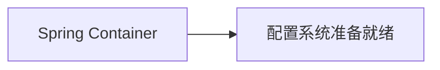

# Spring Framework
version:5.3.16
## Spring IoC

控制反转(IoC)，也叫依赖注入(DI)

过程：
>对象通过构造函数参数、工厂方法的参数或在对象实例被构造或从工厂方法中返回后设置的属性来定义它们的依赖关系。
>然后容器在创建bean时注入这些依赖项。

Spring IoC容器的核心是org.springframework.beans和org.springframework.context

BeanFactory接口提供了高级配置机制，管理任何类型的对象

ApplicationContext是BeanFactory的子接口

org.springframework.context.ApplicationContext接口表示Spring IoC容器，主要负责实例化、配置和组装bean

容器通过读取配置元数据来获取要实例化、配置和组装对象的指令

配置元数据可以使用XML、Java注释或Java代码

ApplicationContext 提供了实现
通常会通过ClassPathXmlApplicationContext或FileSystemXmlApplicationContext使用XML元数据来创建实例




元数据配置
```XML
<?xml version="1.0" encoding="UTF-8"?>
<beans xmlns="http://www.springframework.org/schema/beans"
    xmlns:xsi="http://www.w3.org/2001/XMLSchema-instance"
    xsi:schemaLocation="http://www.springframework.org/schema/beans
        https://www.springframework.org/schema/beans/spring-beans.xsd">

    <!-- 可以通过import引入其他的元数据XML -->
    <import resource="config.xml"/>


    <!-- BeanName命名规范 以小写字母开头，后续使用驼峰式命名 栗子（"metaData"）-->
    <bean id="..." class="...">  
        <!-- collaborators and configuration for this bean go here -->
    </bean>

</beans>
```

实例化容器
```Java
ApplicationContext context=new ClassPathXmlApplicationContext("metadata.xml")
```

==不推荐是用"../"路径来引用父目录中的文件，建议使用：file:C:/config/config.xml或classpath:/config/config.xml==


使用容器
```Java
// 创建和配置beans
ApplicationContext context=new ClassPathXmlApplicationContext("metadata.xml")

// 获取实例对象
MetaData metadata=context.getBean("metaData",MetaData.class);

// 使用对象属性
System.out.println(metadata)
```

Bean定义别名
```XML
<!-- name表示bean中所写的neam属性 alias表示所使用的别名 -->
<alias name="fromName" alias="toName"/>
```
==JavaConfiguration 可以使用@Bean来提供别名==


通过构造函数进行实例化
```xml
<bean id="helloWorld" class="redcrazyghost.HelloWorld"></bean>
```
默认使用的HelloWorld的空参构造器

通过静态工厂方法进行实例化
```xml
<bean id="iService" class="redcrazyghost.IService" factory-method="create"></bean>
```

```Java
public class IService{
    private static IService i=new IService();
    private IService(){}
    public static create(){
        return i;
    }
}
```


通过实例工厂进行实例化
```xml
<bean id="myServer" class="redcrazyghost.MyServer"></bean>

<!-- 这里不能使用class -->
<bean id="useMyServer" factory-bean="myServer" factory-method="createServer"></bean>
```

```Java
public class MyServer{
    private static UseMyServer useserver=new UseMyServerImpl();
    public UseMyServer createServer(){
        return useserver;
    }
}
```

FactoryBean是指Spring特定的FactoryBean实现类

依赖注入（DI） 对象仅通过够着函数参数、工厂方法的参数或从工厂方法构建货返回后再对象实例上设置的属性来定义其依赖项

基于构造函数的依赖注入
```Java
public class Test{
    private final Model model;

    public Test(Model model){
        this.model=model;
    }
}
```

构造函数参数解析
```Java
package redcrazyghost.test

public class OneClassTest{
    public OneClassTest(TwoClassTest tow,ThreeClassTest three){
        //操作代码
    }
}
```
TwoClassTest和ThreeClassTest不存在继承关系
<kbd>\<constructor-arg/></kbd>可以不显式制定构造函数参数索引或类型

```XML
<beans>
    <bean id="oneClassTest" class="redcrazyghost.test.OneClassTest">
        <constructor-arg ref="twoClassTest"/>
        <constructor-arg ref="threeClassTest"/>
    </bean>

    <bean id="twoClassTest" class="redcrazyghost.test.TwoClassTest"/>
    <bean id="threeClassTest" class="redcrazyghost.test.ThreeClassTest"/>
</beans>
```


构造函数参数类型匹配
```Java
public class ValueBean{
    private final int year;
    private final String str;

    public ValueBean(int year,String str){
        this.year=year;
        this.str=str;
    }
}
```

使用构造方法传入参数类型匹配 <kbd>type</kbd>
```XML
<bean id="valueBean" class="redcrazyghost.test.ValueBean">
    <constructor-arg type="int" value="2022">
    <constructor-arg type="java.lang.String" value="42">
</bean>
```
使用构造方法传入参数位置索引 <kbd>index</kbd>
```xml
<bean id="valueBean" class="redcrazyghost.test.ValueBean">
    <constructor-arg index="0" value="2022">
    <constructor-arg index="1" value="42">
</bean>
```
使用构造方法传入参数名 <kbd>name</kbd>
```xml
<bean id="valueBean" class="redcrazyghost.test.ValueBean">
    <constructor-arg name="year" value="2022">
    <constructor-arg name="str" value="42">
</bean>
```
如果无法使用参数名称 可使用<kbd>@ConstructorProperties</kbd>注解显式命名构造方法传入参数名
```Java
public class ValueBean{
    private final int year;
    private final String str;

    @ConstructorProperties({"year","str"})
    public ValueBean(int year,String str){
        this.year=year;
        this.str=str;
    }
}
```

基于Setter的依赖注入
通过无参构造器或无参static工厂方法来实例bean后调用bean的setter方法来实现

