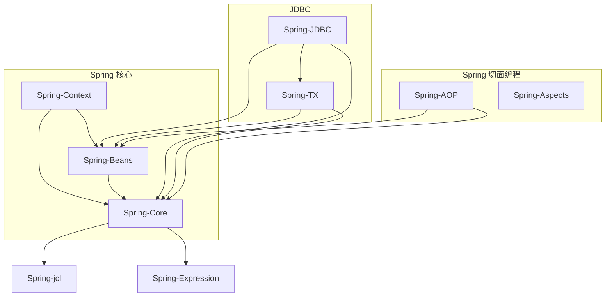

# Spring Framework 依赖关系
> 作者 : RedCrazyGhost
> 创建时间 : 2022-04-23
> 修改时间 : 2022-04-23
> 标签 :  Spring Framework  Java 

```mermaid
   flowchart TB
    beans[Spring-Beans]
    core[Spring-Core]
    tx[Spring-TX]
    aop[Spring-AOP]
    context[Spring-Context]
    jcl[Spring-jcl]
    jdbc[Spring-JDBC]
    expression[Spring-Expression]
    aspects[Spring-Aspects]
    
    subgraph Spring 核心
        context-->core
        context-->beans
    end
    
    core-->jcl
    core-->expression
    
    beans-->core
    
    subgraph JDBC
        jdbc-->beans
        jdbc-->core
        jdbc-->tx
    end

    tx-->beans
    tx-->core

    subgraph Spring 切面编程
        aspects[Spring-Aspects]

        aop-->beans
        aop-->core
    end
```